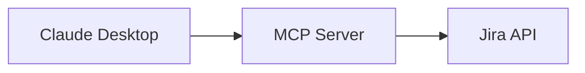

---
paths:
  - docs/**/*.md
  - README.md
  - servers/*/README.md
  - "*.md"
---

# Documentation Standards

## General Principles

- Documentation is for **humans first**, Claude second
- Keep docs concise—implementation details belong in code or skills
- Update docs in the **same session** as related code changes
- Use present tense ("This server provides..." not "This server will provide...")

## Document Purposes

| Document | Audience | Purpose |
|----------|----------|---------|
| Root `README.md` | New users, evaluators | First impression, quick start, feature overview |
| `docs/architecture.md` | Developers, contributors | System design, component relationships, diagrams |
| `docs/tool-catalog.md` | Users, integrators | Complete tool reference (auto-generated) |
| `docs/getting-started.md` | New developers | Setup instructions, prerequisites |
| `docs/DEPLOYMENT.md` | DevOps, admins | Production deployment steps |
| `docs/security-compliance.md` | Security reviewers | Auth model, permissions, compliance |
| `servers/*/README.md` | Server contributors | Server-specific patterns, API quirks |

## When to Update Each Document

### Root README.md
Update when:
- Adding or removing a server
- Changing installation steps
- Adding major features
- Updating tool counts

### docs/architecture.md
Update when:
- Adding new servers or components
- Changing communication patterns
- Modifying authentication flow
- Restructuring the codebase

### docs/tool-catalog.md
**This file should be auto-generated.** Run:
```bash
npm run generate:tool-catalog
```
If the script doesn't exist yet, manually update when tools are added/removed/modified.

### docs/getting-started.md
Update when:
- Prerequisites change (Node version, etc.)
- Environment variables change
- Setup steps change
- New dependencies added

### servers/*/README.md
Update when:
- Adding tools to that server
- Documenting API-specific quirks or limitations
- Adding server-specific configuration options

## Formatting Standards

### Headers
- Use sentence case: "Getting started" not "Getting Started"
- One H1 (`#`) per document—the title
- Use H2 (`##`) for major sections

### Code Blocks
- Always specify language for syntax highlighting
- Use `bash` for shell commands
- Use `typescript` for TS/JS code
- Use `json` for configuration files

### Tables
- Use for structured comparisons (tools, options, mappings)
- Keep tables under 6 columns for readability
- Align columns for source readability

### Tool Documentation Format
When documenting individual tools:
```markdown
### tool_name
**Type**: read | create | update | delete | discovery
**Description**: One-line description of what it does.

**Parameters**:
- `param1` (required): Description
- `param2` (optional): Description, default: `value`

**Returns**: Description of return format

**Example**:
\`\`\`typescript
// Example usage
\`\`\`
```

## Diagrams

- Use Mermaid for diagrams when possible (renders in GitHub)
- Keep diagrams focused—one concept per diagram
- Update diagrams when architecture changes
- Store diagram source in the markdown file, not as separate images

### Mermaid Example


## README Template for New Servers

When creating a new server, include:

```markdown
# server-name

Brief description of what this server provides.

## Tools

| Tool | Type | Description |
|------|------|-------------|
| tool_name | read | What it does |

## Configuration

Required environment variables:
- `VAR_NAME`: Description

## API Notes

Document any Atlassian API quirks, rate limits, or limitations specific to this server.

## Examples

Common usage patterns and examples.
```
